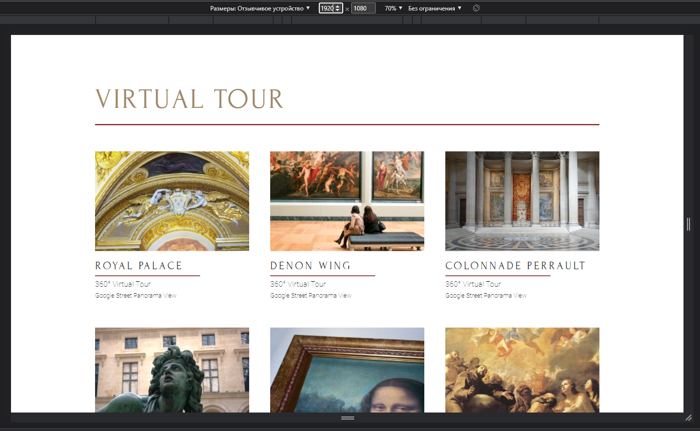
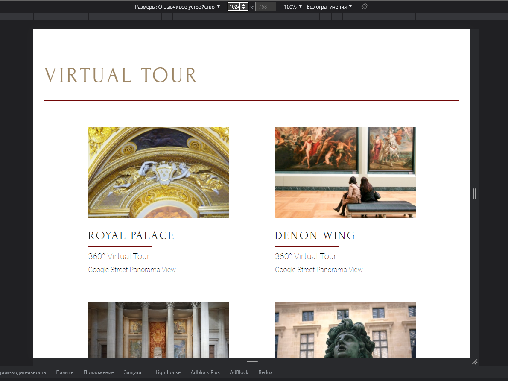
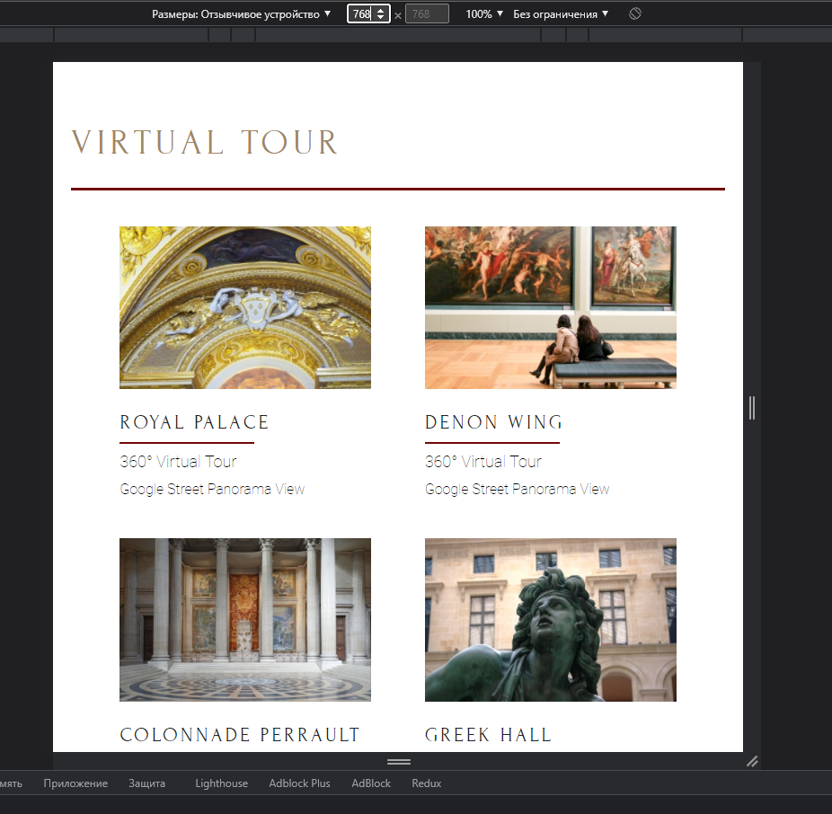
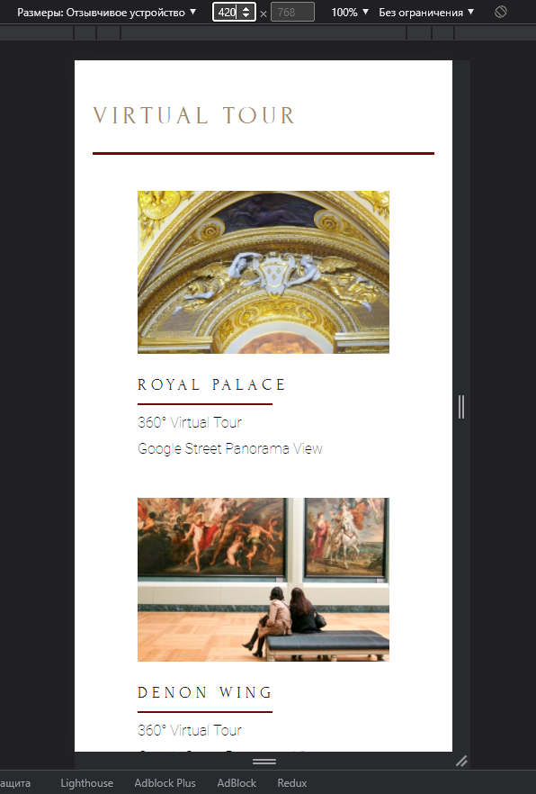

# Training of adaptive layout using BEM

To start, write:

1. git clone https://github.com/AndreyLushchik/TrainAdaptive.git
2. "yarn" or "npm init"
3. "yarn dev" or "npm run dev"

# 1920x1080

# 1024x768

# 768x768

# 420x768

